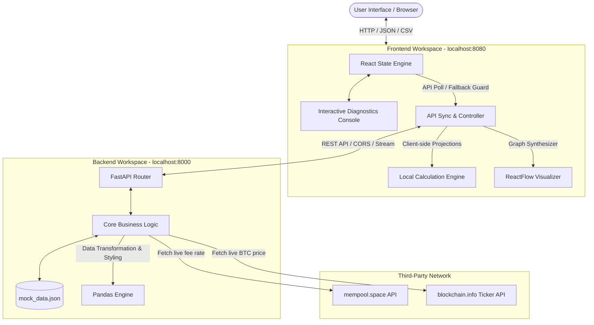

# System Architecture Summary: On-Chain vs Card Settlement Compare

This document provides a technical summary of the architecture of the **On-Chain vs Card Settlement Intelligence** platform. It outlines the data flow, component interactions, resiliency patterns, and data schemas that govern the platform.

---

## 1. High-Level System Architecture

The platform operates on a decoupled client-server architecture with an integrated **Dual-Engine failover mechanism** to ensure maximum reliability and availability.

*(Visualized in the full dashboard interface: [Dashboard View](file:///c:/Users/Adithya%20M/Desktop/new/POC-90-OnChainVsCardSettlementCompare-Adithya_M/POC-90-OnChainVsCardSettlementCompare-Adithya_M/Screenshots/Dashboard_View.png))*



---

## 2. Backend Design (FastAPI & Pandas Engine)

The backend is built with Python using **FastAPI** to route incoming requests and **Pandas** to perform financial diagnostics and data transformations.

### Core Modules
1.  **FastAPI Application (`backend/main.py`)**:
    *   Exposes endpoints to retrieve recommended mempool fees, execute side-by-side ledger calculations, and stream generated CSV files.
    *   Configures Cross-Origin Resource Sharing (CORS) to accept requests from the frontend client.
2.  **Live Network Fetcher with Timeout**:
    *   Queries external APIs (`mempool.space` and `blockchain.info`) asynchronously.
    *   Implements a strict **3-second timeout** per call to avoid hanging requests if network connectivity or remote APIs are congested.
    *   Falls back to local baseline parameters (`sat_per_vbyte = 25`, `btc_price_usd = 68000.0`) in case of failures or time-outs.
3.  **Pandas Diagnostics Engine**:
    *   Loads static scenarios from `mock_data.json`.
    *   Performs credit card fee breakdowns (calculating interchange fees, network assessments, acquirer processing fees, currency FX markup, and flat gateway fees) based on transaction value.
    *   Calculates Bitcoin mining fees independently of transaction value based on transaction size in virtual bytes (`vbytes`) and gas rate (`sat/vB`).
    *   Aggregates these metrics into a Pandas `DataFrame` to verify calculations and construct comparisons.
    *   Outputs results as a styled JSON structure for the compare API, or streams structured CSV streams for exports.

---

## 3. Frontend Design (Next.js & ReactFlow)

The frontend is constructed using **Next.js** (v16.2.7), utilizing **React 19** hooks for local state sync and **ReactFlow** to render the transaction paths.

### Core Frontend Components & Mechanics
1.  **Dual-Engine Calculations**:
    *   On mounting, the client attempts to establish a connection with the backend (URL configured via the `NEXT_PUBLIC_API_URL` environment variable, defaulting to `http://localhost:8000`).
    *   If the backend is reachable, the application relies on the FastAPI server to perform calculations and fetch live BTC exchange rates.
    *   If the backend is unreachable, the client activates its built-in **Local Calculation Engine**. This module replicates the Pandas logic entirely in JavaScript using local constants, providing a zero-downtime failover model.
2.  **State Management**:
    *   Hooks track the selected `useCase`, custom overridden transaction `amount`, custom `satRate`, and live BTC stats.
    *   An `useEffect` lifecycle listener triggers calculation updates (either fetching from backend or calculating locally) immediately when inputs change.
3.  **ReactFlow Graph Synthesizer**:
    *   Dynamically maps transaction paths based on the active rail tab.
    *   **Card Network Path**: Generates interactive nodes representing the complex, multi-party chain (Consumer, Payment Gateway, Acquirer, Card Scheme/Network, Issuing Bank, Merchant).
    *   **On-Chain Path**: Generates a simplified, direct sovereign route (Sender, Bitcoin Miners/Network, Receiver).
    *   Maintains layout coordinate rules to render responsive, clean diagrams for varying browser viewport sizes.
    *   *(Graph visual output reference: [Intermediary Flow Route Visual](file:///c:/Users/Adithya%20M/Desktop/new/POC-90-OnChainVsCardSettlementCompare-Adithya_M/POC-90-OnChainVsCardSettlementCompare-Adithya_M/Screenshots/Inetermediary_Count_and_Transition_Routing_Flow.png))*

---

## 4. Data Schemas

### Scenario Schema (`backend/mock_data.json`)
Each comparison scenario is defined by the following schema structure:
```json
{
  "id": "string",
  "name": "string",
  "description": "string",
  "default_amount": 0.0,
  "card_rail": {
    "name": "string",
    "intermediaries": ["string"],
    "finality_time_seconds": 0,
    "finality_time_display": "string",
    "fee_structure": {
      "interchange_pct": 0.0,
      "network_pct": 0.0,
      "acquirer_pct": 0.0,
      "fx_markup_pct": 0.0, // Optional
      "flat_fee": 0.0
    },
    "counterparty_risk": "string",
    "governance": "string"
  },
  "on_chain_rail": {
    "name": "string",
    "intermediaries": ["string"],
    "finality_time_seconds": 0,
    "finality_time_display": "string",
    "fee_structure": {
      "sat_per_vbyte": 0,
      "tx_size_vbytes": 0
    },
    "counterparty_risk": "string",
    "governance": "string"
  }
}
```

### Compare Response Schema (`/api/compare`)
```json
{
  "scenario_id": "string",
  "scenario_name": "string",
  "scenario_description": "string",
  "amount": 0.0,
  "btc_price": 0.0,
  "sat_per_vbyte": 0,
  "is_live_data": true,
  "price_source": "string",
  "card_rail": {
    "name": "string",
    "intermediaries": ["string"],
    "finality_time_seconds": 0,
    "finality_time_display": "string",
    "interchange_fee": 0.0,
    "network_fee": 0.0,
    "acquirer_fee": 0.0,
    "fx_fee": 0.0,
    "flat_fee": 0.0,
    "total_fee": 0.0,
    "fee_percentage": 0.0,
    "counterparty_risk": "string",
    "governance": "string"
  },
  "on_chain_rail": {
    "name": "string",
    "intermediaries": ["string"],
    "finality_time_seconds": 0,
    "finality_time_display": "string",
    "sat_rate": 0,
    "tx_size_vbytes": 0,
    "total_sats": 0,
    "total_fee": 0.0,
    "fee_percentage": 0.0,
    "counterparty_risk": "string",
    "governance": "string",
    "lightning_alternative": {
      "name": "string",
      "fee": 0.0,
      "fee_percentage": 0.0,
      "finality_time_display": "string"
    }
  },
  "insights": {
    "cost_insight": "string",
    "speed_insight": "string",
    "savings_dollars": 0.0,
    "fee_ratio": 0.0
  },
  "table_data": [
    {
      "Metric": "string",
      "Card": 0.0,
      "On-Chain": 0.0
    }
  ],
  "fed_context": {
    "title": "string",
    "description": "string",
    "average_card_fraud_rate_bps": 0.0,
    "average_chargeback_rate_pct": 0.0,
    "total_us_card_volume_trillion": 0.0,
    "average_settlement_duration_hours": {
      "card": 0.0,
      "ach": 0.0,
      "wire": 0.0,
      "bitcoin": 0.0
    }
  }
}
```

---

## 5. Resiliency Patterns

1.  **Dual calculations core**: The system has a mirrored calculations pipeline (FastAPI/Pandas on the backend vs. Vanilla JavaScript on the frontend). This prevents client dashboards from breaking if servers crash.
2.  **API Timeout Limits**: Prevents the backend from being blocked by slow third-party API networks. If a fetch request takes longer than 3 seconds, fallback values are utilized instantly.
3.  **CORS Security Controls**: Configured explicitly on FastAPI middleware to allow safe cross-origin resource requests for client components while avoiding data leaking or blocked client requests.

---

## 🎥 Architectural Walkthrough Demo

A video walkthrough demonstrating system load, backend request routing, data recalculations upon custom override updates, and the local calculations failover engine in action can be viewed here:
[Play Walkthrough Demo Video](file:///c:/Users/Adithya%20M/Desktop/new/POC-90-OnChainVsCardSettlementCompare-Adithya_M/POC-90-OnChainVsCardSettlementCompare-Adithya_M/Video(Demo)/-OnChain_Vs_Card_Settlement_Compare_DemoVideo.mp4)
